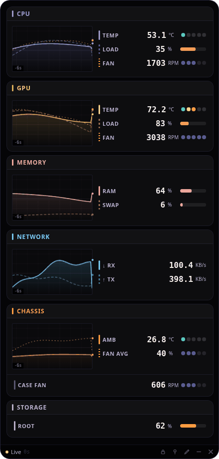

# CC Widget

A lightweight desktop hardware monitor for Linux, powered by [CoolerControl](https://gitlab.com/coolercontrol/coolercontrol).

CC Widget is built to feel like part of your desktop, not another bulky monitoring app competing for attention. It's a small, borderless, always-on-top widget showing live CPU, GPU, memory, storage, network, and fan telemetry - configurable, themeable, and out of your way.



---

## Features

* **Live hardware telemetry** - CPU/GPU temps and load, fan speeds, RAM/swap, disk usage, network throughput - sourced from the [CoolerControl](https://gitlab.com/coolercontrol/coolercontrol) daemon and local Linux system stats
* **Sparkline graphs** with session peak markers, per-metric
* **Three size presets** (S/M/L) to fit your screen and eyesight
* **A real theme system** - over a dozen built-in themes plus a live theme builder with WCAG contrast checking, so you can tune colors and confirm they're actually readable before committing
* **Configurable dashboard** - assign any sensor to any row, add custom rows, even track arbitrary folder sizes on disk
* **Lightweight** - GTK3 + WebKit2, no Electron, minimal footprint
* **Native desktop integration** - proper `.desktop` launcher, optional autostart, standard icon placement

---

## Requirements

* Ubuntu 24.04 or a compatible Debian-based distribution
* [CoolerControl](https://gitlab.com/coolercontrol/coolercontrol) installed and running (see the [docs](https://docs.coolercontrol.org) for setup)
* Python 3

The installer takes care of the rest (`python3-gi`, `gir1.2-webkit2-4.1`, `python3-psutil`) via `apt`.

---

## Installation

Extract the release anywhere - your Downloads folder is fine - and run:

```bash
bash install.sh
```
The installer will:

* Check for and install any missing system dependencies
* Copy CC Widget into `~/.local/share/cc-widget`
* Install the app icon and create a desktop launcher
* Offer to enable autostart

Once installation finishes, the extracted download folder can be deleted.

### First run

Launch CC Widget from your app launcher, or:

```bash
python3 ~/.local/share/cc-widget/launch.py
```

You'll be asked for your CoolerControl daemon URL and an access token. Create a token in CoolerControl under **Settings → Access Protection → Access Tokens**, paste it in, and you're connected.

---

## Updating

Download a newer release and run the installer again:

```bash
bash install.sh
```

Your installed app files are replaced, but your connection, theme, and layout are untouched - those live outside the install directory (see [Configuration & Data Locations](#configuration--data-locations) below).

---

## Uninstalling

```bash
bash uninstall.sh
```

This removes the application, desktop launcher, icon, and cache. It will also ask separately whether to remove your saved configuration - say no if you think you might reinstall later and want to pick up where you left off.

---

## Configuration & Data Locations

CC Widget follows standard XDG conventions, so everything lives where you'd expect to find it (or clean it up) on any Linux system:

| What                                   | Where                          |
|-----------------------------------------|--------------------------------|
| App files                               | `~/.local/share/cc-widget/`    |
| Window position                        | `~/.config/cc-widget/`         |
| Connection, theme, and layout settings  | `~/.config/cc-widget/webkit-data/` |
| Cache                                   | `~/.cache/cc-widget/`          |
| Desktop launcher                        | `~/.local/share/applications/cc-widget.desktop` |
| Icon                                    | `~/.local/share/icons/hicolor/.../cc-widget.*` |

---

## Project Structure

```
cc-widget/
├── install.sh
├── uninstall.sh
├── README.md
└── app/
    ├── launch.py
    ├── monitor.html
    ├── monitor.css
    ├── monitor.js
    ├── themes.js
    ├── icon.svg
    └── ...
```

---

## Acknowledgements

CC Widget wouldn't exist without [CoolerControl](https://gitlab.com/coolercontrol/coolercontrol), which does all the actual work of talking to hardware sensors and fan controllers - this widget is just a small, focused window onto that data.

The app icon was adapted from the [Hatter](https://github.com/Mibea/Hatter) icon theme.

Thanks also to the broader Linux desktop community and the open-source libraries this project builds on: GTK, WebKit2GTK, and psutil.

---

Enjoy your dashboard.
